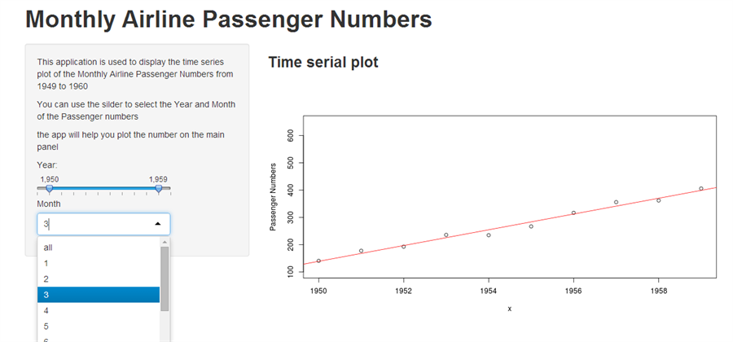

## Introduction
- The data is the classic Box & Jenkins airline data. Monthly totals of international airline passengers from 1949 to 1960.
- This application aims to show the time serie plot with the selected year and month
- It can also to make a regression line in order to make a prediction model.

**You can use it simply and clearly as this:**
- You can find the link of the application here:   
https://tjzzz.shinyapps.io/project1/
- You can choose the year interval and specific month by the slide and select box
- The application will plot the passenger numbers in the main panel.   

---

## An example
The following picture gives an example of how to use the application to make data visualization.


---

```{r,echo=FALSE}
library(datasets);data(AirPassengers)
```

```{r}
dat<-matrix(AirPassengers,12,12)
month=3;  year1=1950;year2=1960
x=year1:year2;  y=dat[month,(year1-1948):(year2-1948)]
plot(x,y,ylab="Passenger Numbers");  abline(lm(y~x),col="red")
```

---

## Wht can we do more
The application has many advantages
- it makes the data visual and more intuitive 
- The operation is very simple and convenient 
- it gives the regression model line to fit the points

**what can be extended**
- we can predict the next year's passenger numbers
- besides, we can select multiple months to have a comparison.


